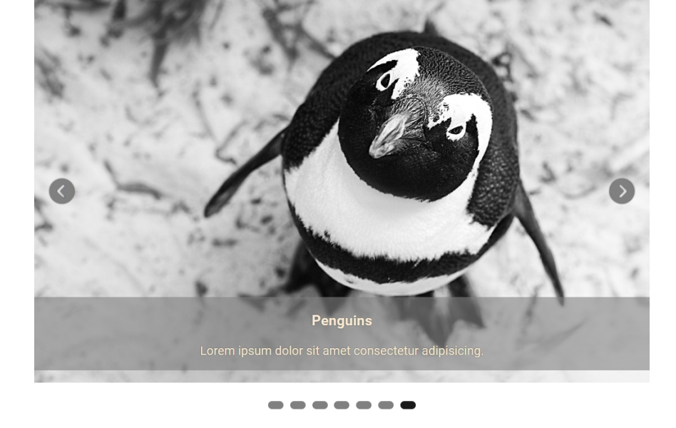

# Build a carousel - Scrimba solo project

Project screen:

**Project Page**
[My carousel](https://lively-parfait-3fc373.netlify.app)

### Project description:

The task was to build a carousel with some additional features:
1. Automated slides transitions (every 3s)
2. Text on the slides
3. Slides indicators
4. Control buttons - user can go back to the previous slide or go to the next - after 3s slides will continue to change
5. User can click on the indicator to go to the chosen slide